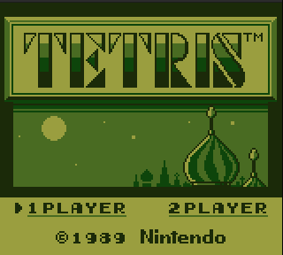

# zetaboy
Game Boy (Color) emulator in Rust.

## Features

- General
  - Emulates DMG and CGB
  - Basic GUI
  - Load ROMs using GUI
  - Save/Load state (with hotkeys)
  - Auto save/load external RAM for games that featured a battery (Like Pokémon)
  - Outputs DMG colors using a palette that closely matches the original LCD
- Audio
  - All 4 channels emulation
  - Basic low-pass filter to reduce aliasing
- Debugger
  - CPU debugging window

## Accuracy Tests

Can be found at https://github.com/retrio/gb-test-roms/

| Symbol | Meaning     |
|--------|-------------|
| ✅     | Passes      |
| ❌     | Fails       |
| ⚠️     | Unsupported |

### Blargg's (Multi-ROMs)

| Test ROM        |    | Note     |
|-----------------|----| -------- |
| cpu_instrs      | ✅ |          |
| instr_timing    | ❌ |          |
| dmg_sound       | ❌ |          |
| mem_timing      | ❌ |          |
| mem_timing-2    | ❌ |          |
| oam_bug         | ❌ |          |
| halt_bug.gb     | ❌ |          |
| cgb_sound       | ⚠️ | GBC Only |
| interrupt_time  | ⚠️ | GBC Only |

### Mooneye - Acceptance

| Test ROM                         |    | Note     |
|----------------------------------|----| -------- |
| bits/mem_oam                     | ✅ |          |
| bits/reg_f                       | ✅ |          |
| bits/unused_hwio-GS              | ⚠️ | GBS Only |
| instr/daa                        | ✅ |          |
| interrupts/ie_push               | ✅ |          |
| oam_dma/basic                    | ✅ |          |
| oam_dma/reg_read                 | ✅ |          |
| oam_dma/sources-GS               | ⚠️ | GBS Only |
| ppu/hblank_ly_scx_timing-GS      | ⚠️ | GBS Only |
| ppu/intr_1_2_timing-GS           | ✅ | GBS Only |
| ppu/intr_2_0_timing              | ✅ |          |
| ppu/intr_2_mode0_timing_sprites  | ❌ |          |
| ppu/intr_2_mode0_timing          | ❌ |          |
| ppu/intr_2_mode3_timing          | ❌ |          |
| ppu/intr_2_oam_ok_timing         | ❌ |          |
| ppu/lcdon_timing-GS              | ⚠️ | GBS Only |
| ppu/lcdon_write_timing-GS        | ⚠️ | GBS Only |
| ppu/stat_irq_blocking            | ⚠️ | NOT DMG0 |
| ppu/stat_lyc_onoff               | ❌ |          |
| ppu/vblank_stat_intr-GS          | ⚠️ | GBS Only |
| serial/boot_sclk_align-dmgABCmgb | ⚠️ |          |
| timer/div_write                  | ✅ |          |
| timer/rapid_toggle               | ✅ |          |
| timer/tim00_div_trigger          | ✅ |          |
| timer/tim00                      | ✅ |          |
| timer/tim01_div_trigger          | ✅ |          |
| timer/tim01                      | ✅ |          |
| timer/tim10_div_trigger          | ✅ |          |
| timer/tim10                      | ✅ |          |
| timer/tim11_div_trigger          | ✅ |          |
| timer/tim11                      | ✅ |          |
| timer/tima_reload                | ✅ |          |
| timer/tima_write_reloading       | ✅ |          |
| timer/tma_write_reloading        | ✅ |          |
| add_sp_e_timing                  | ✅ |          |
| boot_div2-S                      | ⚠️ |          |
| boot_div-dmg0                    | ❌ |          |
| boot_div-dmgABCmgb               | ⚠️ |          |
| boot_div-S                       | ⚠️ |          |
| boot_hwio-dmg0                   | ❌ |          |
| boot_hwio-dmgABCmgb              | ⚠️ |          |
| boot_hwio-S                      | ⚠️ |          |
| boot_regs-dmg0                   | ❌ |          |
| boot_regs-dmgABC                 | ⚠️ |          |
| boot_regs-mgb                    | ⚠️ |          |
| boot_regs-sgb2                   | ⚠️ |          |
| boot_regs-sgb                    | ⚠️ |          |
| call_cc_timing2                  | ✅ |          |
| call_cc_timing                   | ✅ |          |
| call_timing2                     | ✅ |          |
| call_timing                      | ✅ |          |
| di_timing-GS                     | ✅ |          |
| div_timing                       | ✅ |          |
| ei_sequence                      | ✅ |          |
| ei_timing                        | ✅ |          |
| halt_ime0_ei                     | ✅ |          |
| halt_ime0_nointr_timing          | ✅ |          |
| halt_ime1_timing2-GS             | ✅ |          |
| halt_ime1_timing                 | ✅ |          |
| if_ie_registers                  | ✅ |          |
| intr_timing                      | ✅ |          |
| jp_cc_timing                     | ✅ |          |
| jp_timing                        | ✅ |          |
| ld_hl_sp_e_timing                | ✅ |          |
| oam_dma_restart                  | ✅ |          |
| oam_dma_start                    | ✅ |          |
| oam_dma_timing                   | ✅ |          |
| pop_timing                       | ✅ |          |
| push_timing                      | ✅ |          |
| rapid_di_ei                      | ✅ |          |
| ret_cc_timing                    | ✅ |          |
| reti_intr_timing                 | ✅ |          |
| reti_timing                      | ✅ |          |
| ret_timing                       | ✅ |          |
| rst_timing                       | ✅ |          |

### Others

| Test ROM  |    | Note |
|-----------|----| ---- |
| DMG-ACID2 | ❌ | PPU  |
| CGB-ACID2 | ❌ | PPU  |
