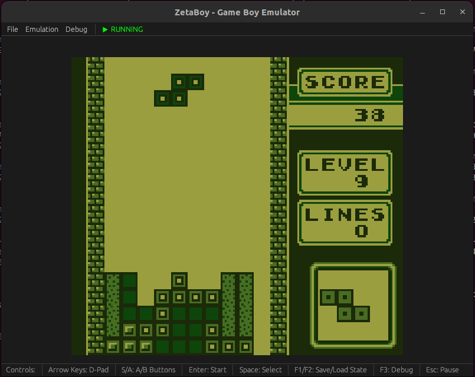

# zetaboy
Game Boy emulator in Rust.

## Accuracy Tests

### Blargg's Test ROMs

Can be found at https://github.com/retrio/gb-test-roms/

| Test ROM        |    | Note     |
|-----------------|----| -------- |
| cpu_instrs      | ✅ |          |
| instr_timing    | ✅ |          |
| dmg_sound       | ❌ |          |
| mem_timing      | ❌ |          |
| mem_timing-2    | ❌ |          |
| oam_bug         | ❌ |          |
| halt_bug.gb     | ❌ |          |
| cgb_sound       | ❌ | GBC Only |
| interrupt_time  | ❌ | GBC Only |